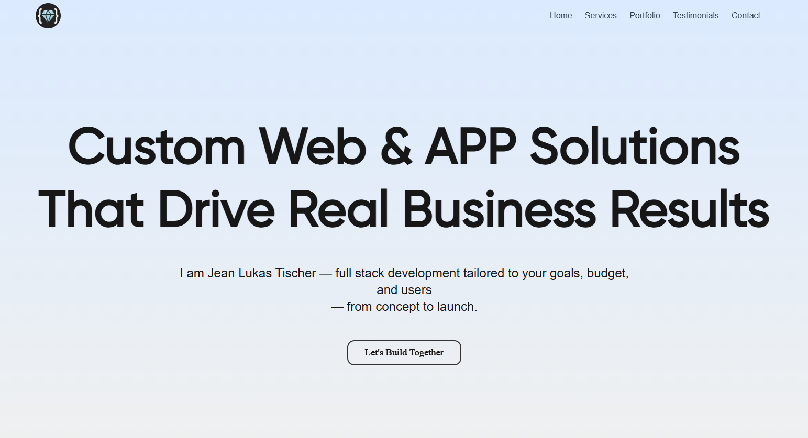

  <!---->
  

    Experienced full-stack developer with expertise in building scalable, high-performance web applications. Proficient in JavaScript, TypeScript, C++, Python, React, Vue.js, Node.js, Express.js, WebGL, and Three.js, with a passion for developing immersive 3D web experiences. Skilled in backend technologies like PHP/Laravel, Python/Django, and Prisma, as well as working with databases such as MongoDB, MySQL, PostgreSQL, and FireBase.  My experience in integrating third-party APIs, developing RESTful and GraphQL APIs, and using real-time technologies like Socket.io further enhances my ability to deliver dynamic, user-centered solutions.
  

 

## <h2 align="center"><a href="https://github.com/code-alchemist99"><b>Go to My Coding hub</b></a></h2>
